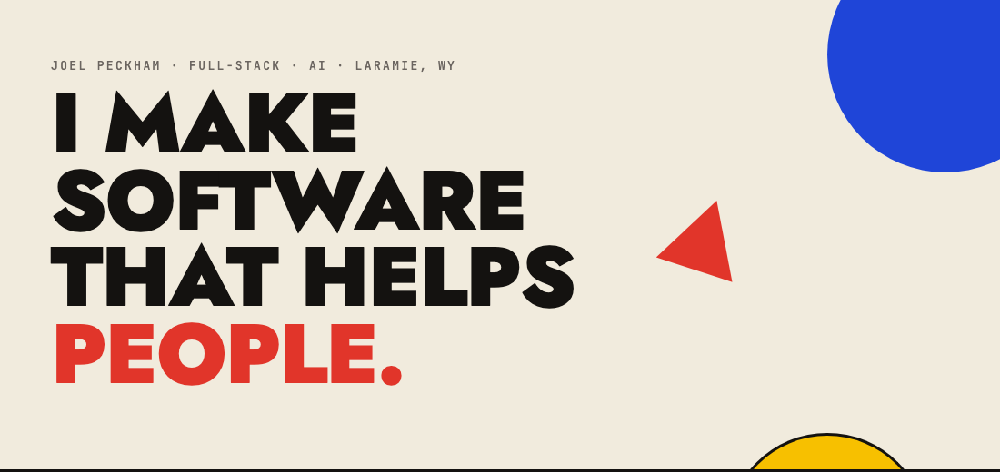

 

## Hi, I'm Joel. Nice to meet you.

I'm a software developer and former graphic designer based in Laramie, Wyoming. I graduated with a B.S. in Computer Science in 2022. I work across the whole stack and I like doing things right — *before* they come back to bite me.

For the last three years I've been at [BetterRx](https://www.betterrx.com/), building the best hospice pharmacy solution on the market. When I'm not coding, I'm outside hiking, climbing, or skiing.

Most of what I build lives on **[jpeckham.com](https://jpeckham.com)** — tools, models, and demos you can try yourself.

### Stack

`PHP` · `Laravel` · `Livewire` · `TypeScript` · `React` · `Next.js` · `Tailwind` · `Postgres`

### Elsewhere

**[jpeckham.com](https://jpeckham.com)** · **[Email](mailto:mail@jpeckham.com)** · **[LinkedIn](https://www.linkedin.com/in/joelpeckham/)** · **[Resume](https://jpeckham.com/Joel_Peckham_Resume.pdf)**
